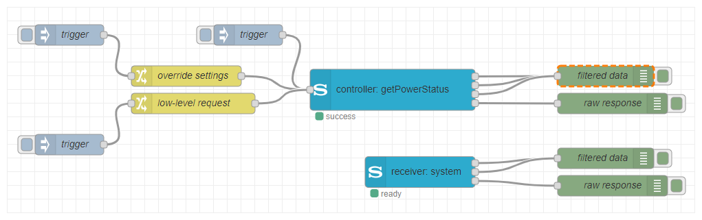

# Node-RED Sony Audio 1.x

A collection of Node-RED nodes for querying and controlling Sony audio devices that support the Sony Audio Control API.

With these nodes you can connect to your Sony audio devices and send control commands (like powering on/off, change volume etc.), retrieve information (like the current volume, the current value of a sound setting etc.) or get notified of certain events (like a change of the power state, a change of the mute state etc.).

---
### NOTE

**[Version 2](https://github.com/jensrossbach/node-red-sony-audio) of Node-RED Sony Audio has been released where large parts of the software have been rewritten. The nodes have been modernized, made much leaner and cleaner and at the same time provide more flexibility and new powerful functionality. As the new release is not compatible with version 1.x and introduces breaking changes, the new nodes have been published as [new package](https://flows.nodered.org/node/@jens_rossbach/node-red-sony-audio). I recommend everyone to migrate to the new package as it allows for more possibilities. Version 1.x will still be maintained for fixing bugs or implementing smaller improvements on user request, but any changes requiring larger efforts will from now on only be done for version 2.x.**

---

If you encountered a bug, would like to propose a new feature or simply want to share your opinion about the software, please have a look at the [contribution guide](https://github.com/jensrossbach/node-red-contrib-sony-audio/blob/master/CONTRIBUTING.md) on the GitHub repository to learn more about how to contribute to this project. If you need help or have questions, please check out the [instructions for getting support](https://github.com/jensrossbach/node-red-contrib-sony-audio/blob/master/SUPPORT.md).

To see what has changed in recent versions of the software, please have a look at the project's [change log](https://github.com/jensrossbach/node-red-contrib-sony-audio/blob/master/CHANGELOG.md).

## Documentation
The detailed documentation which explains the configuration of the nodes and utilization of input and output messages is available in the wiki of the GitHub repository.

**&rarr; [Documentation Wiki](https://github.com/jensrossbach/node-red-contrib-sony-audio/wiki)**

## License
Copyright (c) 2023 Jens-Uwe Rossbach

This code is licensed under the MIT License.

Permission is hereby granted, free of charge, to any person obtaining a copy
of this software and associated documentation files (the "Software"), to deal
in the Software without restriction, including without limitation the rights
to use, copy, modify, merge, publish, distribute, sublicense, and/or sell
copies of the Software, and to permit persons to whom the Software is
furnished to do so, subject to the following conditions:

The above copyright notice and this permission notice shall be included in all
copies or substantial portions of the Software.

THE SOFTWARE IS PROVIDED "AS IS", WITHOUT WARRANTY OF ANY KIND, EXPRESS OR
IMPLIED, INCLUDING BUT NOT LIMITED TO THE WARRANTIES OF MERCHANTABILITY,
FITNESS FOR A PARTICULAR PURPOSE AND NONINFRINGEMENT. IN NO EVENT SHALL THE
AUTHORS OR COPYRIGHT HOLDERS BE LIABLE FOR ANY CLAIM, DAMAGES OR OTHER
LIABILITY, WHETHER IN AN ACTION OF CONTRACT, TORT OR OTHERWISE, ARISING FROM,
OUT OF OR IN CONNECTION WITH THE SOFTWARE OR THE USE OR OTHER DEALINGS IN THE
SOFTWARE.

## Sony Legal Information
### Disclaimer
THIS SOFTWARE AND ITS AUTHOR ARE NOT AFFILIATED WITH SONY CORPORATION.

### Trademark
The trademark "SONY" and any other product names, service names or logos of SONY used, quoted and/or referenced in this Web Site are trademarks or registered trademarks of Sony Corporation or any of its affiliates.

### License Audio Control API
Copyright (c) 2023 Sony Corporation. All rights reserved.

The 'Audio Control API' is licensed to the user by Sony Video & Sound products Inc. under the license terms of the [Creative Commons Attribution-NoDerivatives 4.0 International Public License](https://creativecommons.org/licenses/by-nd/4.0/legalcode).

For more information, see the official web site of the Sony [Audio Control API](https://developer.sony.com/develop/audio-control-api).